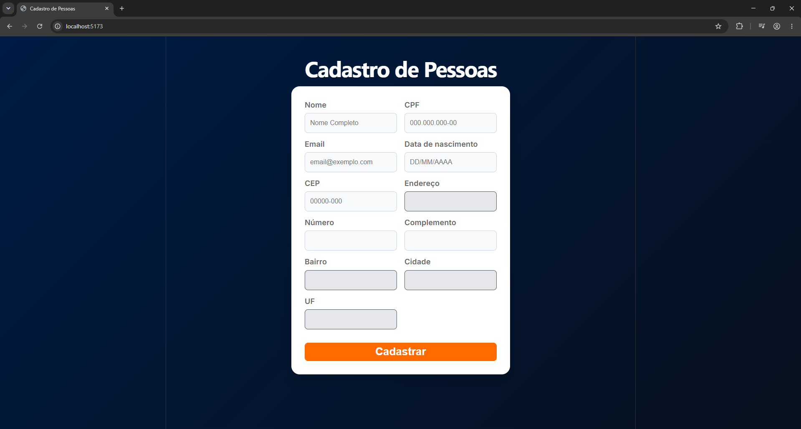
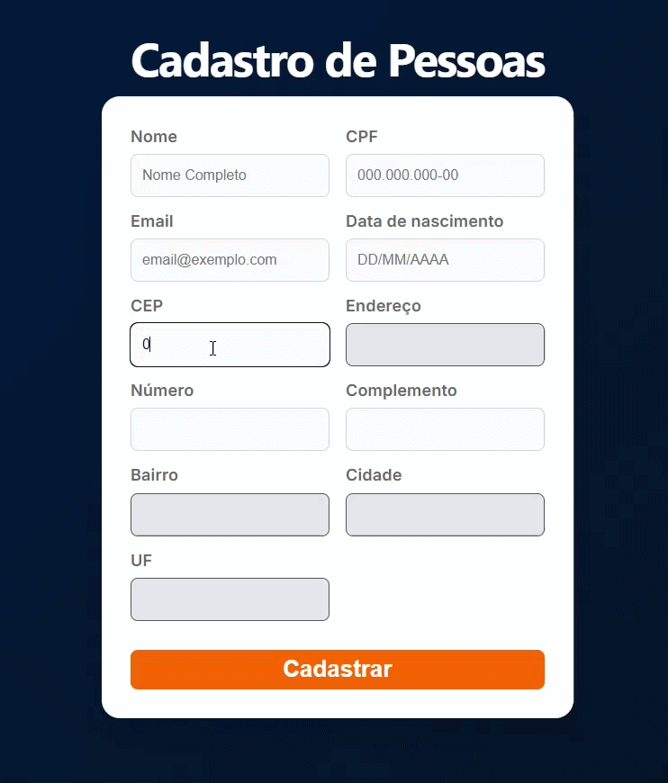
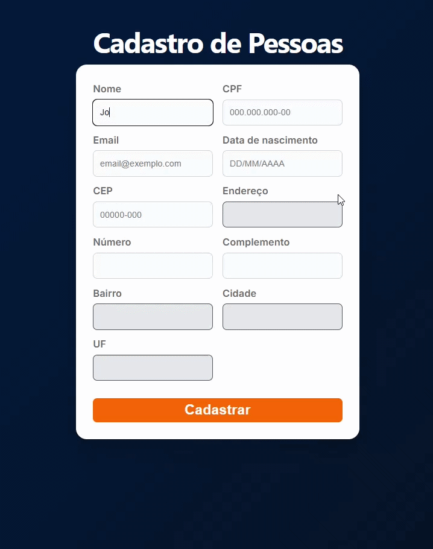
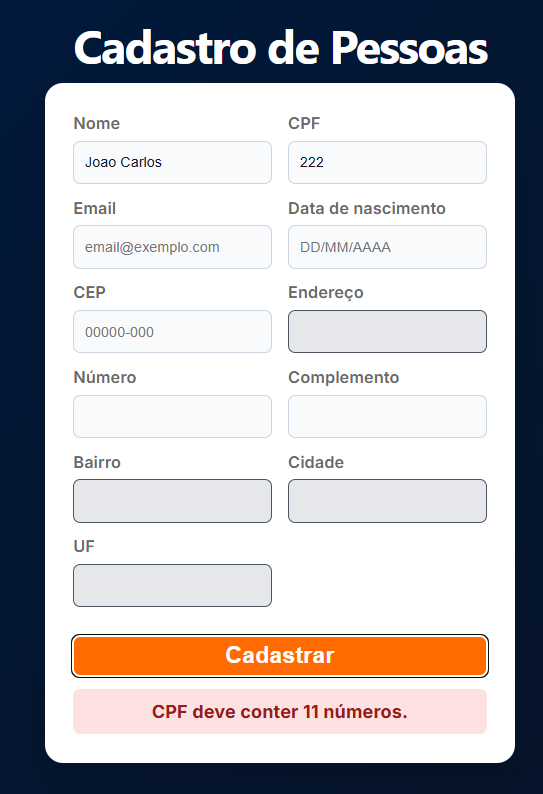
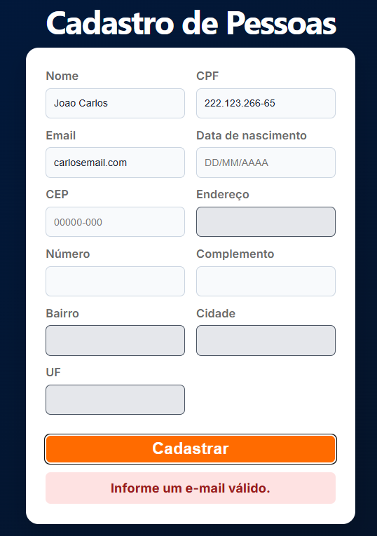
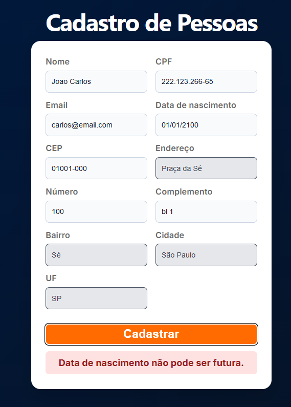
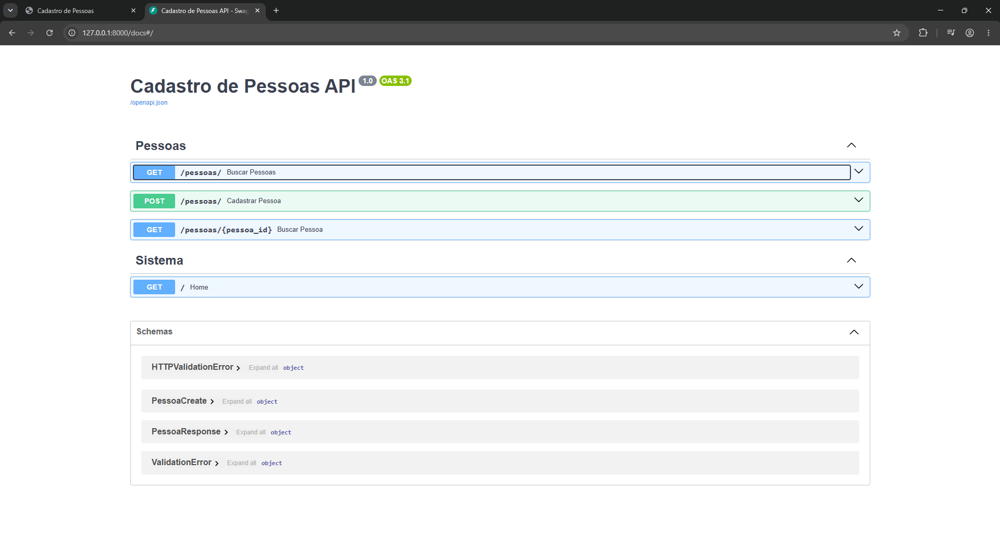

# Cadastro de Pessoas

> Esta branch contém uma versão da aplicação preparada para execução com Docker e Docker Compose.

## Objetivo

Aplicação desenvolvida como desafio técnico para cadastro de pessoas, utilizando FastAPI no backend e React no frontend.

O sistema realiza validação de dados, integração com ViaCEP para preenchimento automático de endereço e geração automática de login único para cada pessoa cadastrada.

## Tecnologias Utilizadas

### Backend

- Python 3
- FastAPI
- SQLAlchemy
- SQLite
- Pydantic
- Uvicorn
- Requests

### Frontend

- React
- Vite
- JavaScript
- CSS

### Containers

- Docker
- Docker Compose

## Funcionalidades

- Cadastro de pessoas
- Consulta de pessoas cadastradas
- Consulta de pessoa por ID
- Integração com ViaCEP para preenchimento automático de endereço
- Geração automática de login único
- Validação de CPF, CEP, e-mail e data de nascimento
- Máscaras para CPF, CEP e data de nascimento
- Feedback visual para sucesso e erro
- Indicador de carregamento durante busca de CEP e cadastro

## Arquitetura da Solução

### Frontend

Desenvolvido em React, responsável pela interface do usuário, validações iniciais dos dados e comunicação com a API.

### Backend

Desenvolvido em FastAPI, responsável pelas regras de negócio, integração com ViaCEP, geração automática de login e persistência dos dados.

### Banco de Dados

Foi utilizado SQLite devido à simplicidade de configuração e adequação ao escopo do desafio.

### Organização do Projeto

O backend foi estruturado em camadas para facilitar manutenção e evolução da aplicação:

- API
- Services
- Repositories
- Schemas
- Database

## Diferenciais Implementados

Além dos requisitos solicitados, foram adicionadas melhorias para proporcionar uma experiência mais próxima de uma aplicação real:

- Separação entre número do endereço e complemento
- Validações no frontend e backend
- Bloqueio de datas futuras para data de nascimento
- Tratamento de duplicidade na geração de login
- Feedback visual para operações de sucesso e erro
- Indicadores de carregamento para operações assíncronas
- Documentação automática da API através do Swagger/OpenAPI
- Containerização da aplicação com Docker e Docker Compose

## Evidências da Aplicação

### Tela inicial



### Consulta automática de CEP



### Cadastro realizado com sucesso



### Validações da aplicação





### Documentação da API



## Execução com Docker

Para iniciar frontend e backend utilizando containers:

```bash
docker compose up --build
```

Após a inicialização:

- Frontend: http://localhost:5173
- Backend: http://localhost:8000
- Swagger: http://localhost:8000/docs

Para encerrar os containers:

```bash
docker compose down
```

## Como executar o projeto manualmente

### Backend

```bash
cd backend

python -m venv venv

venv\Scripts\activate

pip install -r requirements.txt

uvicorn main:app --reload
```

### Frontend

```bash
cd frontend

npm install

npm run dev
```

## Endpoints

### Criar pessoa

POST /pessoas/

### Buscar Lista de pessoas

GET /pessoas/

### Buscar pessoa por ID

GET /pessoas/{id}
